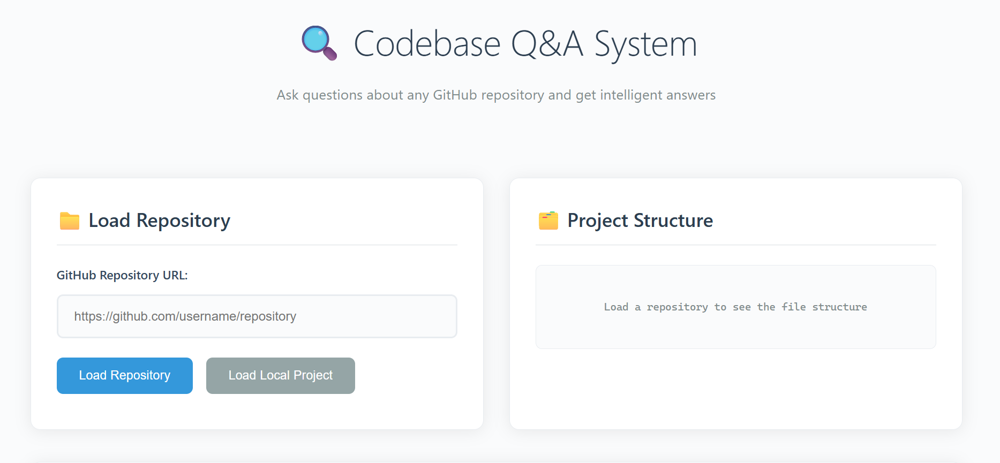
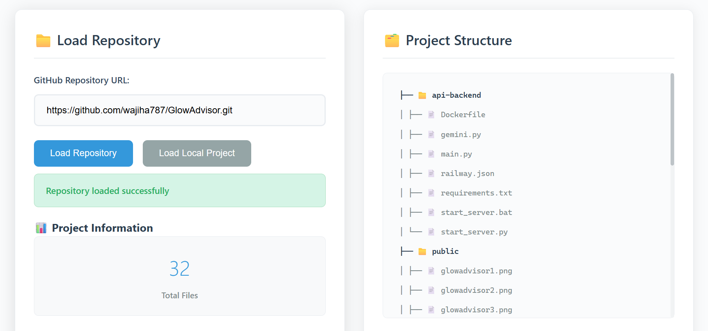
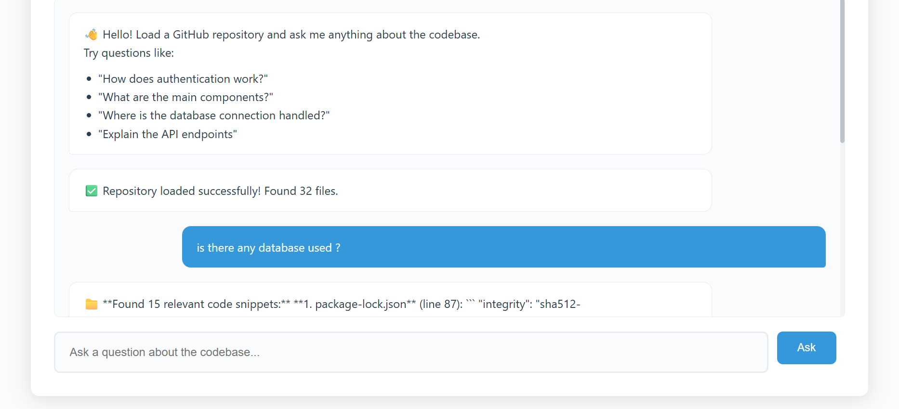

GitHub Codebase Q&A 

A Retrieval-Augmented Generation (RAG) system built with the LangChain framework that allows users to ask natural language questions about any GitHub repository.

The system automatically:

Accepts a GitHub repository URL

Clones the repo and creates a project directory

Indexes the codebase for semantic search

Enables interactive Q&A over the repo using an LLM backend

Perfect for developers who want to quickly understand large or unfamiliar codebases.

✨ Features

🔎 Repo Parsing: Input any GitHub repo URL, the system fetches and structures the codebase.

🧠 RAG Pipeline: Uses LangChain to combine retrieval with LLM reasoning.

💬 Interactive Q&A: Ask natural language questions like "What does main.py do?" or "Where is the database connection handled?".

📂 Project Directory Auto-Creation: Organizes each repo into a dedicated directory for clean handling.

🌐 Web & CLI Support: Run queries from the command line or via a web app.

📂 Project Structure
my_project/
│── templates/            # HTML templates for web interface
│── app.py                # Flask/FastAPI web app
│── gemini_app.py         # Gemini-powered app version
│── main.py               # Main entry point
│── install.py            # Setup script
│── run_web.py            # Script to launch web UI
│── setup_gemini.py       # Setup Gemini environment
│── simple_app.py         # Minimal CLI version
│── simple_web.py         # Minimal web app
│── test_chromadb.py      # ChromaDB integration test
│── test_github.py        # GitHub API/repo test
│── requirements.txt      # Dependencies
│── .env                  # Environment variables
│── README.md             # Project documentation

⚙️ Installation

Clone this repository

git clone https://github.com/wajiha787/Github-codebase-QnA.git
cd Github-codebase-QnA.git

Create and activate a virtual environment (recommended)

python -m venv venv
source venv/bin/activate    # Linux/Mac
venv\Scripts\activate       # Windows

Install dependencies

pip install -r requirements.txt

Set up environment variables

Copy .env_example.txt to .env

Add your API keys (e.g., OpenAI, Gemini, etc.)

▶️ Usage
1. Run via CLI
python simple_app.py

Ask questions like:

Q: What is the purpose of install.py?
Q: Which files handle the web interface?

2. Run Web Interface
python run_web.py

Visit: http://127.0.0.1:5000

Paste a GitHub repo URL and start asking questions!

## 📸 Screenshots  

### Web App UI  
  

### CLI Example  
  

### Another Example  
  

Web App UI

CLI Example

🧪 Testing

Run unit tests:

pytest

🔮 Roadmap

 Support for private GitHub repos

 Add multi-repo Q&A

 Provide code summarization for entire repos

 Docker support

🤝 Contributing

Pull requests are welcome! Please open an issue first to discuss what you’d like to change.